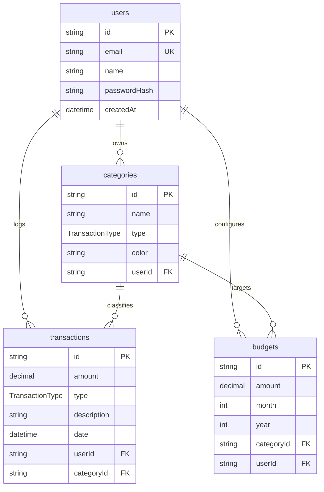

<p align="center">
  <svg width="80" height="80" viewBox="0 0 24 24" fill="none" stroke="white" stroke-width="2" stroke-linecap="round" stroke-linejoin="round" style="background: linear-gradient(135deg, #3b82f6 0%, #1d4ed8 100%); padding: 16px; border-radius: 20px; box-shadow: 0 10px 25px -5px rgba(59, 130, 246, 0.4);">
    <rect x="2" y="4" width="20" height="16" rx="2" />
    <path d="M12 4v16M2 12h20" stroke-opacity="0.1" />
    <path d="M16 10h4a2 2 0 0 1 2 2v2a2 2 0 0 1-2 2h-4V10z" fill="#1d4ed8" />
    <circle cx="19" cy="13" r="1" fill="white" />
  </svg>
</p>

<h1 align="center">FinTrack</h1>
<p align="center"><strong>Personal Finance Tracker</strong></p>

<h2 align="center">Manage your money <span style="color: #3b82f6;">with confidence</span></h2>

<p align="center">
  <em>FinTrack helps you track spending, set budgets, and visualize your financial health — all in a beautiful, easy-to-use dashboard.</em>
</p>

<p align="center">
  <a href="#-key-features">Key Features</a> •
  <a href="#️-tech-stack">Tech Stack</a> •
  <a href="#-local-installation--configuration">Setup Guide</a> •
  <a href="#-deployment-guidelines">Deployment</a>
</p>

<p align="center">
  
  
  
  
  
  
</p>

---


## 🌟 Key Features

### 🔐 1. Secure Authentication & Profile Management
- **JWT-based Security**: Stateless token-based session management.
- **Password Encryption**: Secure password storage utilizing `bcrypt` hashing.
- **Show/Hide password feature**: Smooth eye-toggle toggle button integration using the **Remix Icon** library.
- **Guest / Protected Routing**: Restricts analytics and transaction data access to authenticated users.

### 💸 2. Transaction CRUD Operations
- **Income & Expense Logging**: Effortlessly record inflows and outflows with amount, description, date, and category.
- **Input Validation**: Front-end validation with instant visual feedback and backend schema schema validation using **Zod**.
- **Interactive Data Table**: View, filter, edit, and delete transactions instantly.

### 🎯 3. Smart Category-Wise Budgeting
- **Monthly Spending Limits**: Set custom monthly budgets for specific expense categories (e.g., Food, Utilities, Rent).
- **Progress Gauges**: Clear progress bars that track the percentage of the budget consumed.
- **Overspending Indicators**: Instantly flags categories when spending exceeds set limits.

### 📊 4. Beautiful Visual Analytics (Recharts)
- **Aggregated Financial Cards**: Real-time updates for *Total Income*, *Total Expenses*, *Net Balance*, and *Remaining Budget*.
- **Monthly Trend Charts**: Interactive bar charts highlighting monthly cash flow trends.
- **Category Breakdowns**: Colored donut charts representing the distribution of expenses across categories.
- **Automatic Seed Data**: New users get pre-loaded default categories (Food, Dining, Shopping, Utilities, Salary) to start tracking instantly.

---

## ⚙️ Tech Stack

| Layer | Technology | Key Highlights |
|---|---|---|
| **Frontend** | React 19 + TypeScript | Component-driven architecture, Context API state management |
| **Styling** | Tailwind CSS | Sleek glassmorphism look, responsive flex & grid grids |
| **Bundler** | Vite | Ultra-fast Hot Module Replacement (HMR) and optimized builds |
| **Backend** | Express + TypeScript | Modular routing, validation middleware, and global error handling |
| **ORM** | Prisma | Fast PostgreSQL query builders, schema sync, and migrations |
| **Database** | PostgreSQL | Relational database hosting transactions, users, and budgets |
| **Icons** | Remix Icons & Lucide | Sharp, vector-based glyphs across all interactive menus |

---

## 📁 Project Structure

```text
expenseTrackerProject/
├── backend/
│   ├── prisma/
│   │   ├── schema.prisma      # DB Schema definition
│   │   └── seed.ts            # Default seed database records
│   ├── src/
│   │   ├── controllers/       # Core business logic (auth, budgets, transactions)
│   │   ├── middleware/        # Authentication, validation, and error handles
│   │   ├── routes/            # Express route groups
│   │   ├── types/             # Shared TypeScript structures
│   │   └── utils/             # Prisma client wrapper, helpers
│   ├── railway.json           # Railway cloud configurations
│   └── package.json
│
├── frontend/
│   ├── src/
│   │   ├── api/               # API clients wrapper with Axios
│   │   ├── components/        # Shared buttons, metrics cards, table widgets
│   │   ├── contexts/          # Theme, Auth, and Analytics context engines
│   │   ├── pages/             # Auth pages, Landing, Dashboard, and Analytics
│   │   └── types/             # Shared client types
│   ├── index.html
│   ├── vercel.json            # Vercel SPA routing redirects
│   └── package.json
```

---

## 🗺️ Database Schema Architecture

The database structure features four primary entities configured with cascade-delete integrity:



---

## 🚀 Local Installation & Configuration

### Prerequisites
- Node.js (v18+)
- PostgreSQL running locally (default port: `5432`)

---

### Step 1: Clone and Set Environment Variables

Create a copy of `.env.example` in both folders named `.env`:

#### Backend Setup (`backend/.env`):
```env
DATABASE_URL="postgresql://<user>:<password>@localhost:5432/finance_tracker?schema=public"
JWT_SECRET="use-a-strong-random-key"
PORT=5001
FRONTEND_URL="http://localhost:5173"
```

#### Frontend Setup (`frontend/.env`):
```env
VITE_API_URL="http://localhost:5001/api"
```

---

### Step 2: Set Up Backend

1. Navigate to the backend directory:
   ```bash
   cd backend
   ```
2. Install dependencies:
   ```bash
   npm install
   ```
3. Run Prisma schema generation and push migrations to the DB:
   ```bash
   npm run db:push
   ```
4. Seed the database with default configurations:
   ```bash
   npm run db:seed
   ```
5. Launch the backend dev server:
   ```bash
   npm run dev
   ```
   *The API will listen at `http://localhost:5001`.*

---

### Step 3: Set Up Frontend

1. Navigate to the frontend directory:
   ```bash
   cd ../frontend
   ```
2. Install dependencies:
   ```bash
   npm install
   ```
3. Start the dev server:
   ```bash
   npm run dev
   ```
   *Open `http://localhost:5173` in your browser.*

---

## 🛠️ API Routes Documentation

### Authentication (`/api/auth`)
- `POST /signup` — Register a new user and pre-seed categories.
- `POST /login` — Log in a user and return a JWT.
- `GET /me` — Retrieve the current authenticated user's profile details.

### Transactions (`/api/transactions`)
- `GET /` — Fetch transaction history (supports filters: `month`, `year`, `type`, `categoryId`).
- `GET /:id` — Get single transaction details.
- `POST /` — Create a new transaction.
- `PUT /:id` — Update transaction fields.
- `DELETE /:id` — Remove transaction.

### Budgets (`/api/budgets`)
- `GET /` — Fetch budget configuration for specified month/year.
- `POST /` — Set or update monthly category budget limits.
- `DELETE /:id` — Remove category budget.

### Analytics (`/api/analytics`)
- `GET /` — Generate aggregate metrics, trend history, category splits, and budget comparisons.

---

## ☁️ Deployment Guidelines

### Backend (Railway)
1. Provision a PostgreSQL Database service on Railway.
2. Link your GitHub repository and set the root directory to `/backend`.
3. Link the database by adding variable reference `DATABASE_URL` -> `${{Postgres.DATABASE_URL}}`.
4. Add additional Environment Variables:
   - `JWT_SECRET` (e.g., strong random hash)
   - `FRONTEND_URL` (your deployed Vercel frontend URL, e.g., `https://personal-finance-tracker.vercel.app`)
5. Configure public networking domain matching port **`8080`** (or default).

### Frontend (Vercel)
1. Add a new project on Vercel and import the repository.
2. Set the root directory to `/frontend`.
3. Set the Environment Variable:
   - `VITE_API_URL` -> `https://your-backend-url.up.railway.app/api`
4. Deploy the application.

---

## ✍️ Signature & Authenticity
Created and built with dedication by **Raunak Bhutani**. All rights reserved.
